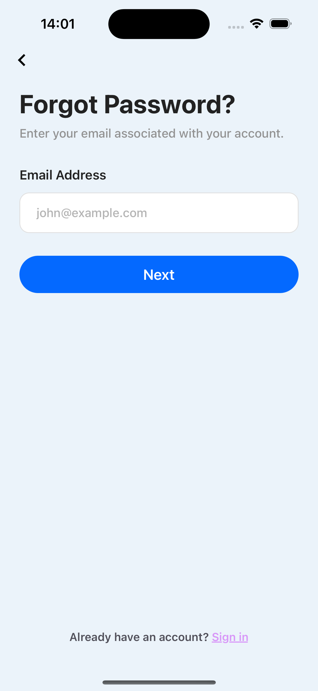

# 📱 Daily Mobile App Challenge

Welcome! This is my daily mobile design and coding challenge.  
Each day I create a new mobile app screen using React Native / Expo.

---

## 🚀 Goals
- Practice building beautiful UI/UX designs.
- Build faster and cleaner mobile layouts.
- Improve mobile development skills daily.

---

## 🗂️ Challenge List

| Day | Title | Preview |
| :-: | :-- | :-: |
| 001 | Login Screen |  |
| 002 | Forgot Password Screen |  |
| 003 | Confirm Code Screen |  |

---

---

## 🛠️ Tech Stack
- React Native
- Expo
- TailwindCSS (optional)
- Figma (for designs)

---

## 📌 Folder Structure
- `challenges/day-xxx-title/`
  - `App.js` — Source code
  - `design.png` — Screenshot of the design
  - `README.md` — Notes for the day

---

Thanks for following along! ✨
